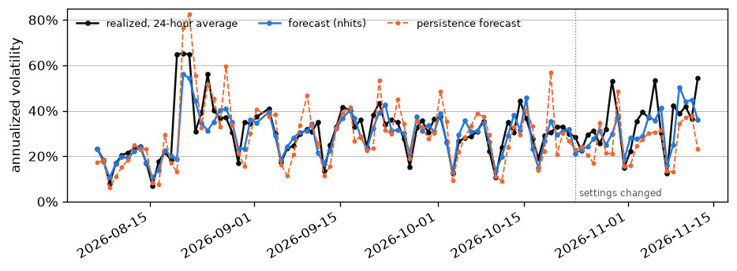

# Daily record (generated)

Forecast days scored: 97. Resolved rows: 18552. Pending (logged, outcome not yet observed): 192.

Every forecast-log row from an earlier run was committed to git before its target hour completed, except on the 5 days listed in [TIMING.md](TIMING.md).

| model                |   days |   pinball_mean |    mae |   cov50 |   cov90 |   skill_vs_persistence |   day_error |   day_skill |
|:---------------------|-------:|---------------:|-------:|--------:|--------:|-----------------------:|------------:|------------:|
| nhits                |     94 |         0.1015 | 0.3168 |  0.4871 |  0.8865 |                 0.2561 |      0.171  |      0.3786 |
| gbm                  |     97 |         0.1071 | 0.3323 |  0.4442 |  0.8471 |                 0.222  |      0.1782 |      0.3538 |
| sarima               |     97 |         0.1134 | 0.3512 |  0.5631 |  0.9171 |                 0.1747 |      0.218  |      0.2091 |
| prophet              |     97 |         0.1195 | 0.3675 |  0.5043 |  0.8544 |                 0.1223 |      0.246  |      0.1078 |
| har_seasonal         |     97 |         0.1238 | 0.3919 |  0.4364 |  0.8673 |                 0.0998 |      0.2368 |      0.1409 |
| har                  |     97 |         0.1269 | 0.4018 |  0.4648 |  0.8729 |                 0.0882 |      0.24   |      0.1293 |
| persistence          |     97 |         0.1406 | 0.4409 |  0.5206 |  0.9098 |                 0      |      0.2757 |      0      |
| seasonal_persistence |     97 |         0.159  | 0.4906 |  0.4613 |  0.8638 |                -0.1669 |      0.3328 |     -0.2074 |

The hourly columns score each of the 24 target hours. cov50 and cov90 are the shares of hours that landed inside a model's 50% and 90% bands, so for well-sized bands they sit near 0.50 and 0.90. The day columns score the day's average volatility, which could be one input to a position size. day_error is the mean absolute log error of the forecast's 24-hour average against the realized average, over fully resolved days, so lower is better. Each hour's forecast in that average is its expected volatility, the middle of its band raised by the band's spread, because the average of a lopsided quantity sits above its middle and an average of 24 middles would run under the realized average. day_skill is one minus the ratio of that error to the persistence model's on the same days, so a positive value beats persistence and 1 would be a perfect forecast.

The days column is each model's own count of scored days. Models that joined the loop later are averaged over fewer days, so the rows above are not sample-matched.

The table above blends the record before and after the model settings changed on 2026-10-23. On the 17 forecast days scored since the change, prophet leads with a mean pinball loss of 0.1035.

Matched on the 94 fully resolved days that both nhits and persistence forecast, the skill of nhits over persistence is 0.28 on the hourly pinball loss (95% interval 0.21 to 0.35) and 0.38 on the day-level error (0.22 to 0.54). Pinball loss scores the whole low-to-high forecast band, not just its middle, and lower is better. The hourly figure pools the loss over those days, while the table's skill_vs_persistence averages the 24 per-hour skills, each model over its own days. Each interval comes from the day-to-day spread of the gap between the two models' daily scores and treats each day as independent of the last. An interval that stays above zero means that, on these days, the lead over persistence is larger than day-to-day noise would explain.

The figure below is that day-level record for nhits, the current leader: its forecast of each day's average volatility, the average that realized, and the persistence model's own forecast of the same average.

